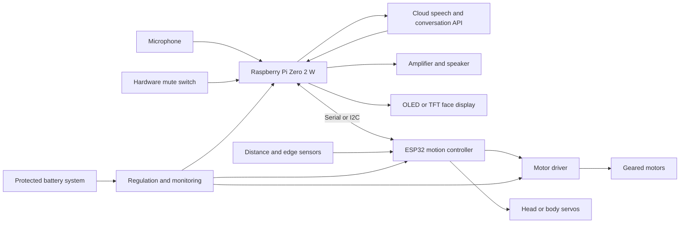

# Proposed architecture

This architecture is an initial direction and should be validated through small
bench experiments before the final enclosure is designed.



## Responsibility split

### Raspberry Pi

- Wake-word and voice-activity detection
- Audio capture and playback
- Cloud API communication
- Conversation state
- Face animation
- High-level behavior commands
- Configuration and diagnostics

### ESP32

- Motor speed and direction
- Servo control
- Fast obstacle and edge safety response
- Battery and sensor sampling
- Watchdog-controlled safe stop

Safety reactions should remain on the ESP32 so the robot can stop even if Linux,
Wi-Fi, or the cloud conversation service is unavailable.

## Suggested software modules

```text
desky/
  audio/          microphone, wake word, playback, interruption
  conversation/   cloud session and dialogue state
  expressions/    eye, smile, and speaking animations
  behavior/       event-to-expression and event-to-motion rules
  motion/         serial protocol and high-level movement commands
  firmware/       ESP32 safety, sensors, motors, and servos
  diagnostics/    health, battery, latency, and error reporting
```

The source-code layout will be created when implementation begins.

## Core event model

Subsystems should communicate using explicit events rather than directly
controlling one another. Candidate events include:

- `wake_word_detected`
- `speech_started`
- `speech_ended`
- `response_started`
- `response_interrupted`
- `sound_direction_changed`
- `obstacle_detected`
- `desk_edge_detected`
- `battery_low`
- `microphone_muted`

## Safety requirements

- Motor power defaults to off during boot, crashes, and communication loss.
- Edge detection overrides conversation-driven movement.
- Initial movement speed is capped in firmware.
- Battery cells use protection and an appropriate charger.
- Motors and the Raspberry Pi use suitable regulation and power isolation.
- A physical power switch remains reachable after assembly.
- Cloud or network failure must not produce uncontrolled motion.

## Open technical questions

- Does the Pi Zero 2 W provide acceptable conversational latency?
- Which microphone works reliably near the speaker and motors?
- Is a single display expressive enough, or are separate eye displays better?
- Which edge sensor performs reliably across different desk colors and finishes?
- Can one battery system handle motor noise without disrupting audio or compute?
- Should wake-word detection run on the Pi or a dedicated audio device?
